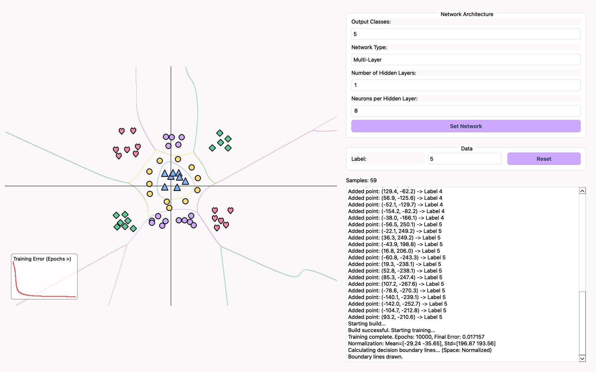
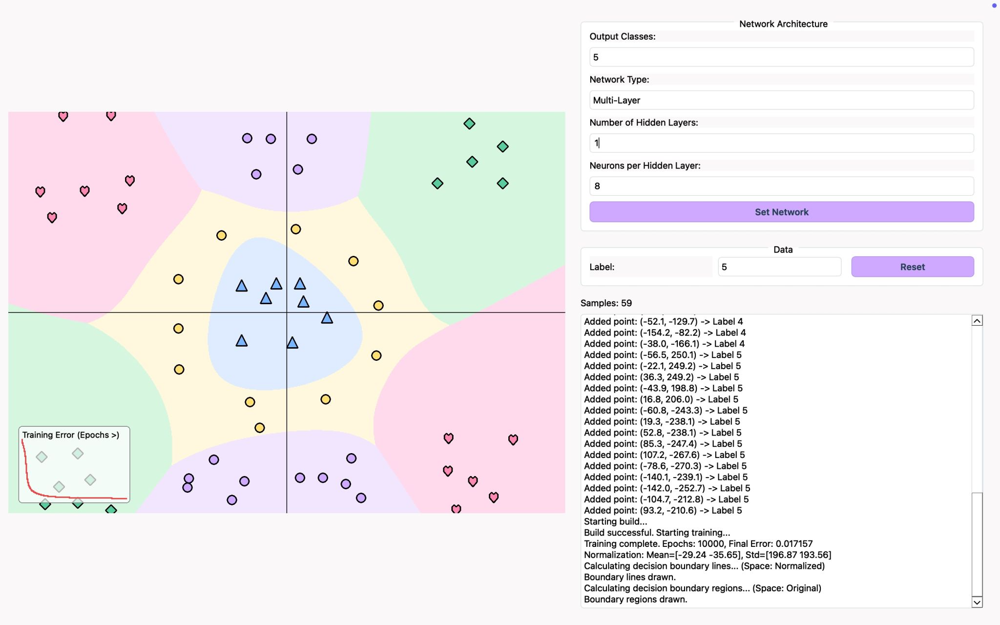

# Machine Learning Algorithms from Scratch

<p align="center">
  
</p>

> A desktop application implementing fundamental supervised machine learning algorithms entirely from scratch in **C++**, including **Binary Perceptron**, **Multiclass Perceptron**, and **Multi-Layer Perceptron (MLP)** with manual training and prediction.

<p align="center">


</p>

---

# Overview

This project is an educational desktop application that demonstrates the implementation of core supervised machine learning algorithms entirely from scratch.

Instead of relying on high-level machine learning frameworks, every stage of the learning process—including forward propagation, weight updates, backpropagation, momentum optimization, and prediction—was manually implemented in C++ to better understand the mathematical foundations behind classification algorithms.

The application provides an interactive interface for training models, visualizing decision boundaries, and evaluating classification performance.

---

# Features

- Binary Perceptron implementation
- Multiclass Perceptron implementation
- Multi-Layer Perceptron (MLP)
- Manual Forward Propagation
- Manual Backpropagation
- Gradient Descent Optimization
- Momentum-based Learning
- Sigmoid Activation Function
- Softmax Output Layer
- Cross-Entropy Loss
- Z-Score Feature Normalization
- Decision Boundary Visualization
- Interactive Training Interface
- Multi-Class Classification

---

# From Scratch Implementation

The machine learning algorithms in this project were implemented manually without relying on ready-made classification models.

Implemented components include:

- Binary Perceptron
- Multiclass Perceptron
- Multi-Layer Perceptron (MLP)
- Feed Forward Computation
- Backpropagation
- Gradient Descent
- Momentum Optimization
- Weight Initialization
- Bias Updates
- Softmax Classification
- Cross-Entropy Loss
- Z-Score Normalization

The primary goal of the project was to understand how machine learning algorithms work internally rather than treating them as black-box models.

---

# Technology Stack

- C++
- Qt Framework
- Object-Oriented Programming (OOP)
- Machine Learning
- Numerical Optimization

---

# Learning Pipeline

```text
Dataset
    │
    ▼
Z-Score Normalization
    │
    ▼
Weight Initialization
    │
    ▼
Forward Propagation
    │
    ▼
Prediction
    │
    ▼
Loss Calculation
    │
    ▼
Backpropagation
    │
    ▼
Gradient Descent + Momentum
    │
    ▼
Updated Model
```

---

# Screenshots

## Model Training

Configure learning parameters, initialize the model, train the classifier, and evaluate prediction performance.

<p align="center">
    
</p>

---

## Decision Boundary Visualization

Visual representation of the classification regions learned by the selected algorithm, showing how the model separates different classes.

<p align="center">
    
</p>

---

# Educational Objectives

This project was developed to gain a deeper understanding of the internal mechanics of supervised learning algorithms by implementing them from scratch.

The implementation focuses on:

- Linear Classification
- Neural Networks
- Gradient-Based Learning
- Optimization Techniques
- Feature Normalization
- Multi-Class Classification
- Mathematical Foundations of Machine Learning

---

# Future Improvements

- ReLU and Tanh activation functions
- Adam optimizer
- Mini-batch Gradient Descent
- Early stopping
- Model serialization
- Training performance visualization
- Confusion matrix analysis
- Additional classification algorithms

---

# Developer

Developed by **Kübra Atlan**

---

# License

This repository is shared for educational and portfolio purposes.
